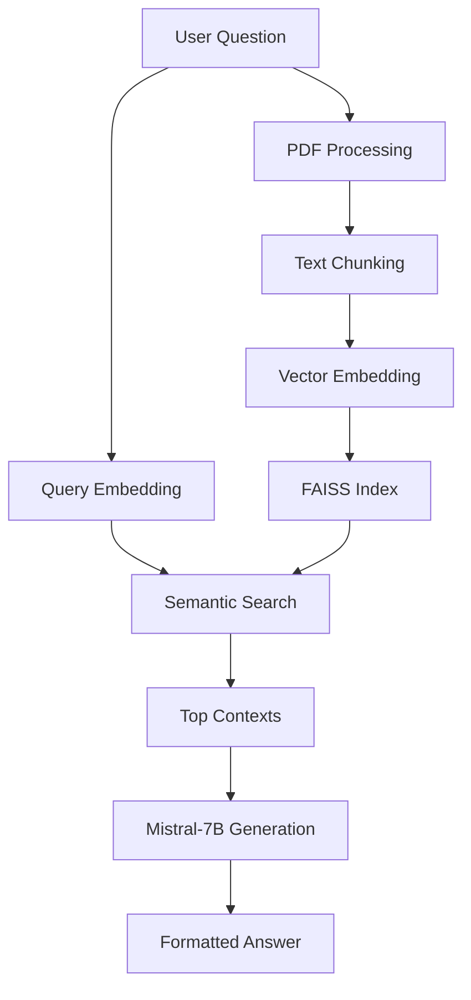

# EduQuest: NCERT Textbook AI Assistant 📚

An AI-powered question-answering system for NCERT textbooks using Retrieval-Augmented Generation (RAG).

)

*Retrieval-Augmented Generation System Overview*

## What is RAG? (Retrieval-Augmented Generation)
RAG combines **information retrieval** with **AI generation** to provide accurate, context-aware answers:

1. **Retrieval**: Searches textbook content using semantic similarity
2. **Augmentation**: Enhances questions with relevant context
3. **Generation**: Produces human-like answers using Mistral-7B

Key Benefits:

 
✔️ Cites textbook sources  
✔️ Adapts to new content without retraining  
✔️ More accurate than generic chatbots 

---
## 🔑 Key Features
- 🎯 Precise textbook answers with page references
- 📤 Upload custom NCERT PDFs
- 🔍 Semantic search across multiple books
- 📈 Confidence score for every answer
- 🛡️ Secure user authentication

---

## 🎯 Use Cases

### For Students
- 📚 Instant homework help with textbook-accurate answers
- 🎯 Exam preparation with direct page references
- 🔍 Clarify complex concepts with AI explanations

### For Parents
- 👨‍👩‍👧‍👦 **Homework Assistance**: Quickly verify answers when helping children
- 📊 **Progress Tracking**: Monitor frequently asked topics
- 🕒 **24/7 Support**: Get textbook help anytime without tutor costs


### For Self-Learners
- 🔗 Cross-subject knowledge linking
- 🎓 Personalized learning assistant
- ⏱️ Time-efficient concept mastery


---

## 🧩 Main Components

### 1. NLP Engine
| Component | Technology | Purpose |
|-----------|------------|---------|
| Text Embedding | MPNet (sentence-transformers) | Convert text to vectors |
| Answer Generation | Mistral-7B-Instruct | Generate human-like answers |
| Query Understanding | Custom Python Logic | Extract key question components |

### 2. Knowledge Base
| Component | Technology | Purpose |
|-----------|------------|---------|
| Textbook Storage | Kaggle Datasets | Host NCERT PDFs |
| Vector Database | FAISS | Fast similarity search |
| User Uploads | Kaggle Working Dir | Temporary PDF storage |

### 3. Interface
| Component | Technology | Purpose |
|-----------|------------|---------|
| Web UI | Gradio | User-friendly interface |
| Auth System | Bcrypt | Secure login/signup |
| Session Mgmt | Python Dicts | Maintain user state |


## 🏗 System Architecture

## 🚀 How to Access (Kaggle Notebook)

### Step 1: Open Notebook
1. Go to your Kaggle account
2. Navigate to **Notebooks** > **Your Work**
3. Locate the `EduQuest_NCERT_Assistant.ipynb` file

### Step 2: Add Datasets
1. In notebook editor:
   - Click **+ Add Input** button
   - Search & add:
     - `mistral/pytorch/7b-instruct-v0.1-hf`
     - Your NCERT dataset (e.g., `ncert-dataset`)


## 🚀 How to Run on Kaggle

### Step 1: Install Dependencies
```python
!pip install -qU gradio faiss-cpu pymupdf bcrypt sentence-transformers
```

### Step 2: Configure Paths
```python
import os
os.environ['MODEL_PATH'] = '/kaggle/input/mistral/pytorch/7b-instruct-v0.1-hf/1'
os.environ['NCERT_PATH'] = '/kaggle/input/ncert-12th-books'
```

### Step 3: Launch the App
```python
from app import app
app.launch(share=True)  # Copy the public URL from output
```

### Step 4: Using the Interface
1. Open the Gradio URL from cell output  
2. Create account or login  
3. Select:  
   - Subject → Chapter  
   - Type your question  
4. Get textbook-accurate answers  


---

## 🛠 Technology Stack

| Category       | Technologies Used |
|----------------|-------------------|
| **Core AI**    | Mistral-7B, FAISS, SentenceTransformers |
| **Backend**    | Python, PyTorch, Bcrypt |
| **Frontend**   | Gradio, HTML/CSS |
| **Storage**    | Kaggle Datasets, Local Files |
| **NLP Tools**  | PyMuPDF, NLTK, Regex |

---

## ❓ Frequently Asked Questions

**Q: How to upload custom textbooks?**  
A: Use the "Upload PDFs" section 

**Q: Why Mistral-7B model?**  
A: Provides best accuracy/speed balance for Kaggle's GPU resources

**Q: Where is my data stored?**  
A: All files remain in Kaggle's temporary workspace (cleared after session)


**Q: Why sometimes answers are incomplete?**  
A: Depends on available context - try rephrasing questions

**Q:Is my data secure?**  
A: All uploads are deleted after session ends


---

## 📌 Important Notes for Kaggle
- Notebook available in **Files** section
- Enable GPU for faster responses (Settings → Accelerator → GPU)
- Session data persists for 90 minutes of inactivity

**Need help?** 

- Dhruvi Mahale: [22CS036@charusat.edu.in](mailto:22CS036@charusat.edu.in)
- Shruti Panchal: [22CS044@charusat.edu.in](mailto:22CS044@charusat.edu.in)
- Dhruvi Patel:[22CS053@charusat.edu.in](mailto:22CS053@charusat.edu.in)


